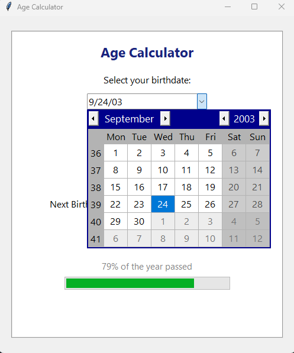
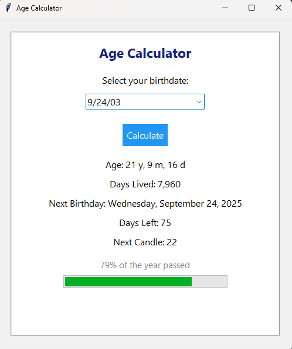
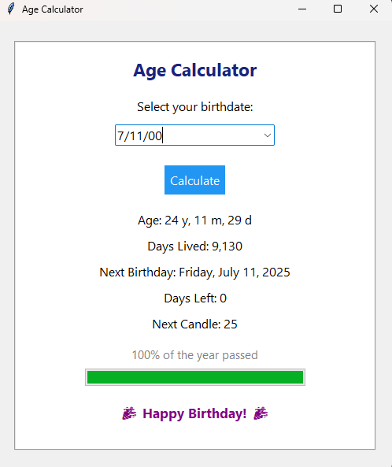

# 🎈 Age Calculator - GUI Based (Tkinter)

A modern and interactive desktop application built with Python's Tkinter that calculates your age based on your selected birthdate.


---

## ✨ Features

- ✅ Select your birthdate using a **date picker** (Gregorian only)
- 📆 Displays your **exact age** in years, months, and days
- 📅 Shows your **next birthday** and the **day of the week** it falls on
- ⏳ Calculates how many **days are left** until your next birthday
- 🕯️ Tells you which **candle number** you'll blow out next
- 📊 Displays a **progress bar** showing how much of the year has passed
- 🎉 Surprise message if today is your birthday!

---

## 📸 GUI Preview

<p align="center">
  
  
  
</p>

---

## 🛠️ Requirements

- Python 3.x
- [tkcalendar](https://pypi.org/project/tkcalendar/)

Install `tkcalendar` via pip:

```bash
pip install tkcalendar
````

---

## 🚀 How to Run

1. Clone the repository or download the `.py` file.
2. Install the dependencies (see above).
3. Run the script:

```bash
python age_calculator.py
```

---

## 📂 File Structure

```
Age-Calculator/
│
├── AgeCalculator.py        # Main application code
├── README.md               # Project documentation
└── LICENSE                 # MIT license
└── screenshot1.png          # image
└── screenshot2.png          # image
└── screenshot3.png          # image

```

---

## 📄 License

This project is open-source and available under the MIT License.


